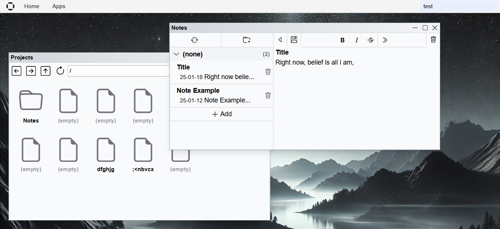

# Projects

[](https://github.com/Reterics/projects/actions/workflows/build.yml)



This is a [Next.js](https://nextjs.org) based a desktop-style, multi-document interface (MDI) application for project management and note-taking. 

It supports:
 - categorizing and storing notes and project details
 - executing custom commands
 - storing data locally (IDB, file) and in cloud (Google Firestore).

It utilizes Next JS Static Site Generation, hence it can be deployed to everywhere.

## Getting Started

First, run the development server:

```bash
npm run dev
# or
yarn dev
# or
pnpm dev
# or
bun dev
```

Open [http://localhost:3000](http://localhost:3000) with your browser to open the application.

## License

This project is licensed under the [MIT License](./LICENSE).
